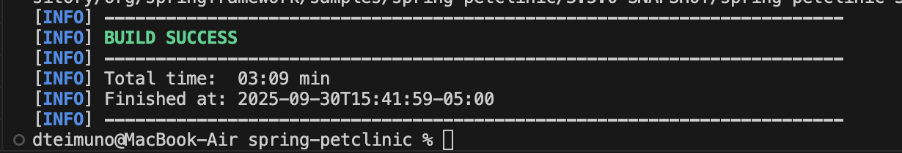

## Monitoring Java Application, Cluster and Kubernetes Components With Prometheus and Grafana

# 1. Deploy your Application and Prepare the Setup
- To get the process started, I will create my k8s cluster so that I can start the process. The k8s cluster takes close to 10 minutes to provision most times:

```
export AWS_ACCESS_KEY_ID=<you-aws-access-key>
export AWS_SECRET_ACCESS_KEY=<your-aws-secret-access-key>
eksctl create cluster --name=dtmcluster --region=us-east-1
```

- I will clone the repository for the project by using the command:


```
git clone https://github.com/spring-projects/spring-petclinic.git
cd spring-petclinic
```
- I intend to also perform Prometheus monitoring on this application so I went to the maven repository and added a ton of Prometheus dependencies that will be installed that should allow for tracking:

```
https://prometheus.io/docs/instrumenting/clientlibs/
```

- I will then install all my dependencies and build my project using:

```
mvn clean install
```



- I will then create the Dockerfile with the components below:

```
FROM techiescamp/jre-17:1.0.0
COPY /target/*.jar /app/java.jar
EXPOSE 8080
```

- I will build my project in the project root using the command:

```
docker build -t dteimuno/kube-petclinic-app:3.0.0 .
```


